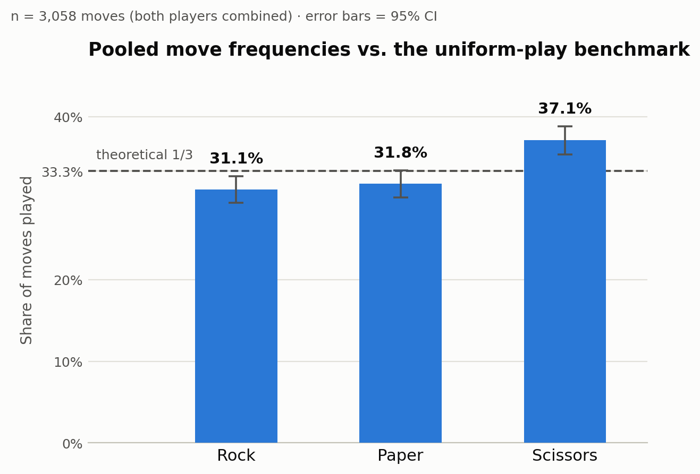

# Step 3 — Testing Uniform Play (Chi-Square Goodness-of-Fit)

## 3.1 What we're testing

Recall H0 from Step 1: each move is drawn i.i.d. Uniform{Rock, Paper,
Scissors}, so in the population P(Rock) = P(Paper) = P(Scissors) = 1/3.
This step runs the standard chi-square goodness-of-fit test against that
H0, using the move counts in `data/rps_rounds.csv`.

## 3.2 Test statistic

For k = 3 categories with observed counts O_i and expected counts
E_i = n/3 under H0, the chi-square statistic is

  chi^2 = sum over i of (O_i - E_i)^2 / E_i,

which, under H0, is approximately chi-square distributed with k - 1 = 2
degrees of freedom. The large-sample approximation is valid here since
every expected count is far above the usual rule-of-thumb minimum of 5.

## 3.3 Pooled result (both players combined)

Pooling every individual move choice from both players (n = 3,058):
Rock 951 (31.1%), Paper 972 (31.8%), Scissors 1,135 (37.1%).

**chi^2 = 19.90, df = 2, p ≈ 0.00005**

This rejects H0 at any conventional significance level (0.05, 0.01, even
0.001). Real play in this dataset is not uniform across the three moves —
Scissors is played noticeably more often than the 1/3 benchmark predicts.

95% confidence intervals (Wald) for each move's true probability:

- Rock: 31.1% (95% CI: 29.5%–32.7%)
- Paper: 31.8% (95% CI: 30.1%–33.4%)
- Scissors: 37.1% (95% CI: 35.4%–38.8%)

Only Scissors' interval sits clearly above 33.3%; Rock's and Paper's
intervals both straddle or sit at/below it.

## 3.4 Splitting by player position

The dataset's `move_a` / `move_b` columns are an arbitrary labeling
convention imposed during Step 2's cleaning (not tied to any real
identity), so we checked whether both positions show the same pattern:

- Position A (n = 1,529): Rock 459, Paper 482, Scissors 588 —
  chi^2 = 18.58, df = 2, **p ≈ 0.00009** (significant)
- Position B (n = 1,529): Rock 492, Paper 490, Scissors 547 —
  chi^2 = 4.11, df = 2, **p ≈ 0.128** (not significant at 0.05)

Both positions lean the same direction (more Scissors), but only
position A's deviation clears the significance bar on its own; position
B's is weaker and not statistically distinguishable from uniform play at
this sample size. This is a reasonable consequence of splitting one
already-modest pooled effect across two halves of the data — it does not
mean the two positions are fundamentally different, just that halving the
sample makes a real but modest effect noisier to detect in each half. This
is worth returning to once a power analysis (planned for the Monte Carlo
step) can say how much data is actually needed to detect an effect this
size reliably.

## 3.5 Bonus check: outcome distribution

Step 1 also predicted that, if both players play i.i.d. Uniform
independently, Tie / A_win / B_win should each be about 1/3. Observed:
Tie 551 (36.0%), A_win 502 (32.8%), B_win 476 (31.1%), n = 1,529 rounds.

**chi^2 = 5.69, df = 2, p ≈ 0.058**

This misses the conventional 0.05 threshold, though only just. There's a
hint that ties happen a little more often than pure randomness would
predict — consistent with the Scissors over-play (if both players lean
toward the same move, they tie more) — but it isn't strong enough evidence
on its own to reject outcome-uniformity at the usual threshold.

## 3.6 Conclusion so far

The core finding of this step: move choices in this dataset are **not**
uniformly random. People favor Scissors over Rock and Paper more than
chance would predict, and this isn't just noise — it clears a very strict
significance threshold (p ≈ 0.00005) once the data is pooled. This
directly motivates Step 4: if the marginal distribution isn't uniform,
the natural next question is whether there's also structure *over time* —
does what happened last round predict the next move? That's exactly what
the independence test and Markov chain modeling in Step 4 investigate.

## Files

- `analysis/step3_uniformity_test.py` — the script that produced these
  numbers and the chart, reproducible from `data/rps_rounds.csv`
- `analysis/step3_results.json` — raw numeric results
- `analysis/step3_move_frequencies.png` — the chart above