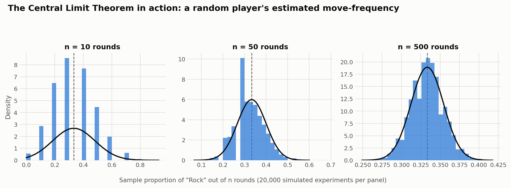
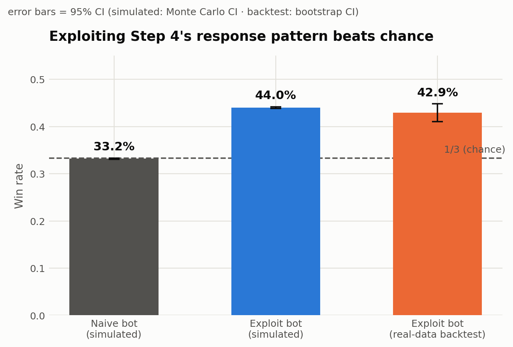
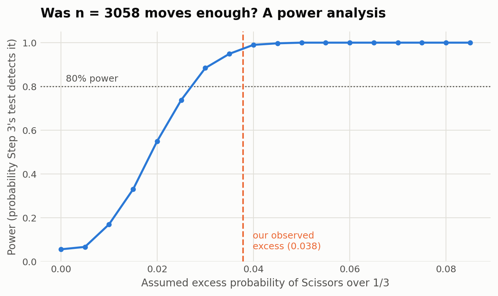

# Step 6 — Monte Carlo Simulation and the Exploit Bot

This step has three parts: use simulation to make the Central Limit
Theorem concrete, build a bot that actually exploits Step 4's finding and
test it, and check whether our sample size was even big enough to have
found what it found.

## 6.1 The Central Limit Theorem, made visible

If a player really does pick Rock/Paper/Scissors uniformly at random,
their *estimated* probability of playing Rock after n rounds is itself a
random quantity — and the CLT says its distribution should approach a
normal curve as n grows, centered on 1/3 with shrinking spread. We
simulated 20,000 independent players at three sample sizes and plotted
the distribution of their estimated "Rock" frequency against the normal
curve the CLT predicts:

At n = 10 rounds the distribution is lumpy and discrete (only 11 possible
outcomes: 0/10, 1/10, ..., 10/10) and the normal curve is a poor fit — the
CLT hasn't "kicked in" yet. By n = 50 it's already noticeably bell-shaped,
and by n = 500 the histogram and the normal curve are nearly
indistinguishable, with the spread visibly much tighter. This is the same
convergence-with-narrowing-uncertainty idea from Step 5's Bayesian
credible intervals, now shown from the frequentist/sampling-distribution
side.

## 6.2 Building the exploit bot

Step 4 found that people tend to **Upgrade** (cycle toward the move that
beats their own last move) after winning, and **Downgrade** (cycle
toward the move their last move would have beaten) after losing. That's
enough structure to build a predictive bot:

> After observing the opponent's previous move and whether they won,
> lost, or tied: assume they'll Upgrade if they won, Downgrade if they
> lost, and Upgrade if they tied (it was the (very slightly) more common
> response in our data). Predict their move accordingly, then play
> whatever move beats that prediction.

This is deliberately the simplest possible bot — it always assumes the
*most likely* response rather than weighing all three probabilities, and
it plays randomly on the first round of a match (no history yet).

**Simulated test.** We built a synthetic opponent that behaves exactly
according to Step 4's fitted response probabilities (not just the mode —
the full distribution), then ran 2,000 simulated matches of 200 rounds
each (400,000 rounds total) for both the exploit bot and a naive
uniform-random bot playing the same synthetic opponent:

- **Naive bot:** 33.2% win rate (95% CI: 33.1%–33.3%) — indistinguishable
  from chance, exactly as expected for a bot with no strategy.
- **Exploit bot:** 44.0% win rate (95% CI: 43.8%–44.2%) — a full 11
  percentage points above chance. A one-sided test of this win rate
  against 1/3 gives z ≈ 143, p ≈ 0: about as decisive as a statistical
  result gets.

## 6.3 Does it hold up on the real data?

The simulated result depends on how well our fitted model captures real
behavior. As a check, we ran the *exact same bot rule* directly against
the real historical transitions from Step 4 (2,572 of them) — a
deterministic backtest rather than a simulation, since the "opponent" here
is the real recorded data, not a synthetic model of it:

**Real-data backtest: 42.9% win rate** (bootstrap 95% CI: 41.0%–44.8%,
from 5,000 resamples), essentially matching the simulated exploit bot's
44.0%. An exact one-sided binomial test against 1/3 gives p ≈ 3 × 10⁻²⁴.
The close agreement between the simulated and real-data win rates is
itself a useful validation: it means the simplified generative model used
for the Monte Carlo simulation isn't just internally consistent, it's
actually capturing how these real players behaved.

## 6.4 Was our sample big enough? A power analysis

Step 3 found a highly significant deviation from uniform play with our
1,529-round dataset. But how much of that is luck of a favorable sample
size versus a real, easily-detectable effect? We simulated many synthetic
datasets of the same size (3,058 moves) under a range of assumed "excess
Scissors probability" values and recorded how often Step 3's chi-square
test would correctly reject uniformity at α = 0.05:

At an assumed excess of 0 (i.e., truly uniform play), the test rejects
about 5.6% of the time — right where it should be, since a valid test
should have a false-positive rate equal to its significance level. Power
climbs steeply after that: by an excess of 0.03 it's at 88%, and by 0.04
it's essentially 100%. Our actual observed excess (Scissors at 37.1% vs.
the 33.3% benchmark, a gap of 0.038) sits right at the point where power
is already about 98–99%. In plain terms: our dataset wasn't just barely
big enough to detect this — it had comfortable room to spare, which is
consistent with how decisively Step 3's test rejected uniformity
(p ≈ 0.00005).

## 6.5 Conclusion

All three pieces reinforce each other. The CLT simulation shows *why*
our confidence/credible intervals behave the way they do as sample size
grows. The exploit bot shows the Step 4 finding isn't just statistically
significant — it's *practically* exploitable, worth about 11 percentage
points of win rate over chance, and the effect replicates whether tested
in simulation or directly on the real data. And the power analysis
confirms our dataset was large enough to find this reliably, not just by
chance. Step 7 pulls all of this together into a single results summary.

## Files

- `analysis/step6_monte_carlo_exploit_bot.py` — the script that produced
  every number and all three charts, reproducible from
  `data/rps_rounds.csv` and `analysis/step4_results.json`
- `analysis/step6_results.json` — raw numeric results for all three parts
- `analysis/step6_clt_demo.png`, `analysis/step6_exploit_bot_results.png`,
  `analysis/step6_power_curve.png` — the charts above

## Next step

Step 7: pull the results from Steps 3–6 together into a single summary
(tables, key figures) as the report's Results section.
