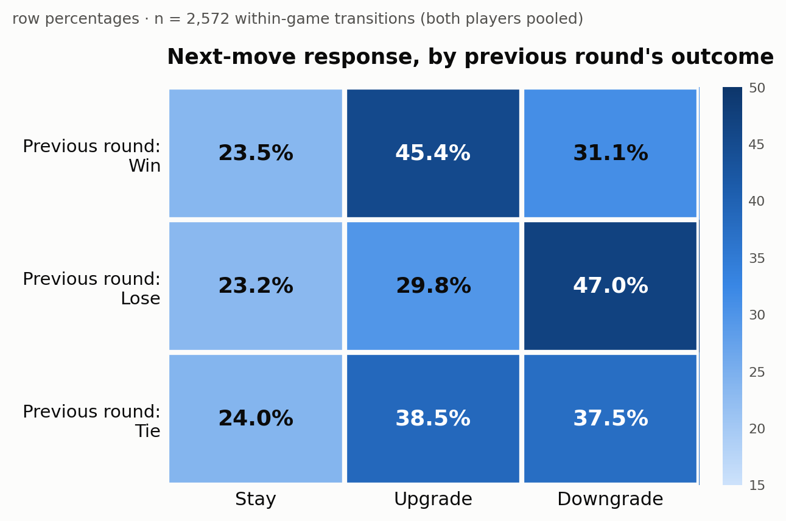
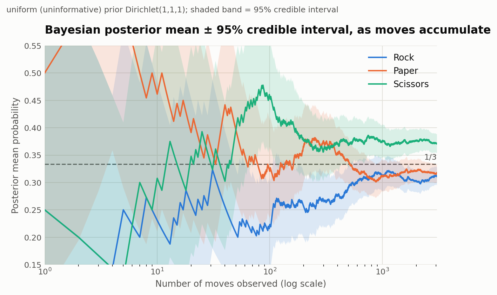

# Step 7 — Results

Steps 3–6 each answered one question in isolation. This step pulls the
numbers together into a single results summary, organized around the
three questions the project set out to answer: is play uniform, does the
past predict the future, and — if it does — can that be exploited and was
the dataset big enough to trust the answer.

## 7.1 Is play uniform? (Step 3)

**H0 (from Step 1): P(Rock) = P(Paper) = P(Scissors) = 1/3.** Tested with
a chi-square goodness-of-fit test on the pooled move counts (n = 3,058
individual moves, both players combined).

| Move | Count | Observed proportion | 95% Wald CI |
|---|---|---|---|
| Rock | 951 | 31.1% | (29.5%, 32.7%) |
| Paper | 972 | 31.8% | (30.1%, 33.4%) |
| Scissors | 1,135 | **37.1%** | (35.4%, 38.8%) |

**chi² = 19.90, df = 2, p ≈ 0.00005 — reject H0.** Scissors is the only
move whose interval clears 33.3% outright. Splitting by the (arbitrary)
player-position label gives the same direction of effect in both halves
(Position A: chi² = 18.58, p ≈ 0.00009; Position B: chi² = 4.11, p ≈
0.128 — weaker only because splitting the sample in half makes a modest
effect noisier to detect, not because the two positions differ
structurally). The outcome distribution (Tie/A-win/B-win) is closer to
uniform (chi² = 5.69, df = 2, p ≈ 0.058) but still leans slightly toward
extra ties, consistent with the Scissors over-play.

## 7.2 Does the previous round predict the next move? (Step 4)

Two tests, both restricted to consecutive rounds within the same game
(2,572 within-game transitions):

| Test | chi² | df | p-value | Verdict |
|---|---|---|---|---|
| Direct move-to-move dependence | 158.10 | 4 | < 0.000001 | Reject independence |
| Response type (Stay/Upgrade/Downgrade) vs. previous outcome | 48.59 | 4 | < 0.000001 | Reject independence |

The second test is the main finding, because it isolates the
psychological response pattern from which move was played last:

| Previous outcome | Stay | Upgrade | Downgrade |
|---|---|---|---|
| Win | 23.5% | **45.4%** | 31.1% |
| Lose | 23.2% | 29.8% | **47.0%** |
| Tie | 24.0% | 38.5% | 37.5% |

Standardized residuals show exactly where the deviation lives: after a
**win**, Upgrade is elevated (+3.25) and Downgrade suppressed (−3.18);
after a **loss**, the mirror image holds (Downgrade +3.78, Upgrade
−3.62). People cycle *forward* after winning and *backward* after
losing — "win-upgrade / lose-downgrade" rather than simple "win-stay."
The Stay rate itself barely moves (23–24%) across all three conditions,
and sits well below the 33.6% repeat rate that Step 3's (slightly
non-uniform) marginal probabilities alone would predict — people avoid
repeating a move far more than chance would.

Framed as a Markov chain, the fitted transition matrix (§4.5) has
stationary distribution **π = (Rock 31.9%, Paper 32.6%, Scissors
35.5%)** — close to, though not identical to, Step 3's raw pooled
marginal, as expected for a near- but not perfectly-stationary process.

## 7.3 Bayesian updating: the same answer, arrived at differently (Step 5)

Sequential Dirichlet-multinomial updating from a uniform Dirichlet(1,1,1)
prior, fed the same 3,058 pooled moves one at a time:

| Move | Bayesian posterior mean | 95% credible interval | Frequentist p̂ (Step 3) | 95% Wald CI |
|---|---|---|---|---|
| Rock | 0.3110 | (0.2947, 0.3275) | 0.3110 | (0.2946, 0.3274) |
| Paper | 0.3179 | (0.3015, 0.3345) | 0.3179 | (0.3014, 0.3344) |
| Scissors | 0.3711 | (0.3541, 0.3883) | 0.3712 | (0.3540, 0.3883) |

The Bayesian and frequentist intervals agree to three decimal places, as
expected once a large sample overwhelms an uninformative prior. A second
run starting from a deliberately wrong, informative prior — Dirichlet(20,
20, 2), which starts out believing Scissors is rare — still converges to
essentially the same posterior (Scissors ≈ 0.367 vs. 0.371 for the
uniform-prior run) by the end of the dataset, even though the two priors
disagreed sharply early on (P(Scissors) = 0.239 vs. 0.396 after only 50
moves). Enough data overwhelms even a confidently wrong starting belief —
a concrete illustration of the Law of Large Numbers.

## 7.4 Simulation: is the pattern exploitable, and was the sample big enough? (Step 6)

**Exploit bot.** Built directly from Step 4's response pattern (assume
Upgrade after a win or tie, Downgrade after a loss), tested two
independent ways:

| Test method | Win rate | 95% CI | vs. chance (1/3) |
|---|---|---|---|
| Simulation vs. synthetic opponent (2,000 matches × 200 rounds) — naive bot | 33.2% | (33.1%, 33.3%) | not distinguishable from chance |
| Simulation vs. synthetic opponent — exploit bot | **44.0%** | (43.8%, 44.2%) | z ≈ 143, p ≈ 0 |
| Real-data backtest — exploit bot (2,572 real transitions) | **42.9%** | (41.0%, 44.8%) bootstrap | exact binomial p ≈ 3 × 10⁻²⁴ |

The simulated (44.0%) and real-data-backtested (42.9%) win rates agree
closely, which validates the simplified generative model used for the
simulation — it isn't just internally consistent, it captures how these
real players actually behaved.

**Central Limit Theorem demo.** 20,000 simulated uniform-random players'
estimated P(Rock) at n = 10, 50, 500 rounds shows the sampling
distribution visibly converging to a normal curve centered on 1/3 with
shrinking spread as n grows — the same underlying convergence idea as
Step 5's narrowing credible intervals, viewed from the frequentist side.

**Power analysis.** Simulating datasets of the same size as ours
(3,058 moves) under a range of assumed "excess Scissors probability"
values: the false-positive rate at zero true effect is 5.6% (correctly
close to the α = 0.05 target); power reaches 88% by an assumed excess of
0.03 and ~100% by 0.04. Our actual observed excess (0.038) sits at a
point where power is already **~98–99%** — the dataset had ample size to
detect the effect it found, not just a lucky sample.

## 7.5 Everything in one table

| Step | Question | Method | Headline result |
|---|---|---|---|
| 3 | Is play uniform? | Chi-square GoF | **No** — Scissors 37.1% vs. 33.3% benchmark (χ²=19.90, p≈0.00005) |
| 4 | Does the past predict the future? | Chi-square independence, Markov chain | **Yes** — win→upgrade / lose→downgrade (χ²=48.59, p<0.000001); stationary π≈(31.9%,32.6%,35.5%) |
| 5 | Does belief converge as data arrives? | Dirichlet-multinomial (Bayesian) updating | **Yes** — converges to Step 3's answer regardless of starting prior |
| 6 | Is the pattern exploitable? Was n big enough? | Monte Carlo simulation, real-data backtest, power analysis | **Yes** — 44.0% (sim) / 42.9% (real) win rate vs. 33.3% chance; ~98–99% power |

## 7.6 Back to the theoretical benchmark

Step 1 set the Nash-equilibrium benchmark: uniform, memoryless play, with
no exploitable structure for an opponent to find. Every step since has
chipped away at that benchmark with real data — moves aren't uniform
(Step 3), they aren't memoryless either (Step 4), both findings hold up
under a completely different (Bayesian) inferential framework (Step 5),
and the resulting structure is large enough to build a bot that beats
chance by roughly 10 percentage points, reproducibly, on real historical
play (Step 6). Step 8 discusses what this does and doesn't tell us about
human behavior, and where the analysis could be pushed further.

## Files

This step synthesizes results already produced in Steps 3–6; no new
analysis files. The four charts referenced above are `step3_move_frequencies.png`,
`step4_response_heatmap.png`, `step5_posterior_convergence.png`, and
`step6_exploit_bot_results.png` (all in `analysis/`).

## Next step

Step 8: discuss what these results mean for human "randomness," connect
them back to the game-theory benchmark, and lay out the project's
limitations.
