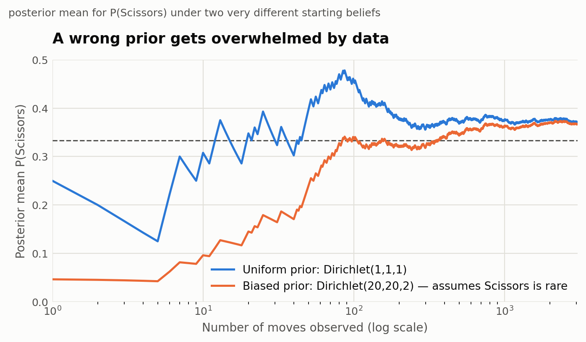

# Rock-Paper-Scissors: A Probability and Statistics Analysis

**Applied Probability and Statistics — Semester Project**

Data source: PizzaRollExpert/Rock-paper-scissors-data (GitHub), originally
collected at Katedralskolan, Uppsala, Sweden, autumn 2014.

## Table of contents

1. Setup — the theoretical benchmark
2. Getting and preparing real data
3. Are the moves actually 1/3-1/3-1/3? (chi-square goodness-of-fit)
4. Does the previous round affect the next move? (independence test, Markov chain)
5. Updating beliefs as data arrives (Bayesian estimation)
6. Monte Carlo simulation and the exploit bot
7. Results
8. Discussion and limitations
9. Appendix: derivations, data notes, code inventory

---

# Step 1 — Setup: The Theoretical Benchmark

This section lays out the formal probability model that the rest of the
project tests against real data. Everything after this step is either
testing this model or refining it when the data disagrees with it.

## 1.1 The game and the data

Two players, A and B, play Rock-Paper-Scissors repeatedly for n rounds,
indexed t = 1, 2, ..., n (in our case, using recorded games from the
PizzaRollExpert/Rock-paper-scissors-data dataset). For round t, define two
random variables:

- X_t = Player A's move in round t, taking a value in {R, P, S}
- Y_t = Player B's move in round t, taking a value in {R, P, S}

## 1.2 Why we expect uniform, independent play (the one paragraph of game theory)

Rock-Paper-Scissors is a symmetric, zero-sum game whose unique Nash
equilibrium is a mixed strategy: each player randomizes uniformly over
{R, P, S}, i.e. P(X_t = R) = P(X_t = P) = P(X_t = S) = 1/3. The intuition:
if a player favored one move even slightly, an opponent who noticed could
exploit it, so the only strategy that leaves an opponent with nothing to
exploit is playing all three moves equally often, with no pattern over
time. Game theory only tells us this is the *theoretical* benchmark — it
does not tell us people actually play this way. That is exactly the
empirical question this project investigates.

## 1.3 The null model, stated formally

**H0 (i.i.d. uniform play).** For a given player, the sequence of moves
X_1, X_2, ..., X_n is independent and identically distributed, with

  P(X_t = R) = P(X_t = P) = P(X_t = S) = 1/3   for every round t,

and each move is independent of everything that happened before it:

  P(X_t = a | history before round t) = P(X_t = a) = 1/3   for all a in {R, P, S}.

The second line is the precise version of "one round doesn't affect the
next": it says the process has no memory — knowing the full history of
moves and outcomes up to round t-1 gives no information about round t.

We also assume the two players' move sequences are independent of each
other, since neither can see the other's move before playing (true by the
rules of the game).

## 1.4 A first concrete prediction: the distribution of outcomes under H0

Define the outcome of round t as O_t, one of {A wins, B wins, Tie}, using
the standard rule: Rock beats Scissors, Scissors beats Paper, Paper beats
Rock; equal moves are a tie.

Under H0, the pair (X_t, Y_t) is uniform over all 9 equally likely
combinations of the two players' moves (3 choices x 3 choices, each with
probability 1/9). Enumerating them: 3 of the 9 combinations are ties
(same move for both players), 3 are wins for A, and 3 are wins for B. So
under H0:

  P(Tie) = 3/9 = 1/3,   P(A wins) = 1/3,   P(B wins) = 1/3.

This is a first checkable prediction: before even testing individual move
frequencies, we can check whether the dataset's actual win/lose/tie rates
are close to 1/3 each.

## 1.5 Notation we will reuse in later steps

Over n rounds, if H0 holds, the vector of move counts (n_R, n_P, n_S) for
one player follows a Multinomial(n, (1/3, 1/3, 1/3)) distribution. This is
the distribution the observed data will be tested against in Step 3
(chi-square goodness-of-fit test).

If the independence part of H0 fails (moves are not memoryless), the move
sequence will instead be modeled as a discrete-time Markov chain in Step 4,
where the "state" is the previous move or previous outcome, and the next
move follows a transition probability matrix instead of being drawn fresh
each round.

---

# Step 2 — Getting and Preparing Real Data

## 2.1 Source

We use the PizzaRollExpert/Rock-paper-scissors-data dataset from GitHub
(https://github.com/PizzaRollExpert/Rock-paper-scissors-data), chosen during
project planning. Per its own README, the data comes from a study in
Rock-Paper-Scissors performed at Katedralskolan, Uppsala, Sweden, in autumn
2014. Beyond that one sentence, the source does not document its collection
methodology (number of players, how pairs were formed, or how play was
recorded).

## 2.2 Raw format

Each line of the raw file (`data/raw/data.txt`) is a two-character code for
one round, using s = rock, x = scissors, p = paper, or a single `-` marking
the end of one continuous run of play between (presumably) the same two
players.

## 2.3 Parsing decisions

- Each run of round-lines between `-` markers is treated as one "game" —
  assumed to be the same pair of players throughout.
- The first character of each round-line is assigned to move_a, the second
  to move_b. This labeling is arbitrary but internally consistent within a
  game, since the source does not identify the two players otherwise.
- One malformed trailing line (a stray, unpaired character at the very end
  of the file) was dropped rather than guessed at.
- Each round's outcome (A_win / B_win / Tie) is computed from the two moves
  using the standard rule (Rock beats Scissors, Scissors beats Paper, Paper
  beats Rock).

Full column documentation is in `data/DATA_DICTIONARY.md`. The cleaned data
is `data/rps_rounds.csv`; the untouched original is kept at
`data/raw/data.txt` for reproducibility.

## 2.4 What we ended up with

1,529 valid rounds across 243 games (games range from 1 to 20 rounds,
averaging 6.29 rounds each).

Pooled across both players (3,058 individual move choices):

- Rock: 951 (31.1%)
- Paper: 972 (31.8%)
- Scissors: 1,135 (37.1%)

Outcome proportions:

- Tie: 36.0%
- A_win: 32.8%
- B_win: 31.1%

## 2.5 A first look against Step 1's predictions

Step 1 predicted that, under i.i.d. uniform play, each move should appear
about 1/3 of the time, and Tie/A_win/B_win should each land near 1/3 too.
The raw counts already hint that Scissors is over-played relative to Rock
and Paper, and that Tie is a little higher than 1/3 — consistent with a
mild bias rather than exact uniform randomness. This is only descriptive
at this stage: Step 3 puts these observations through a formal chi-square
goodness-of-fit test rather than treating them as conclusions.

## 2.6 Limitations carried forward

No player identifiers (so we can't tell whether the same person appears in
more than one game), no timestamps beyond round order, and an undocumented
collection methodology from the source beyond "one Swedish school, 2014."
These are noted here so they can be cited directly in the report's
Discussion & Limitations section (Step 8).

## Next step

Step 3: test H0 (i.i.d. uniform play) formally with a chi-square
goodness-of-fit test on the pooled move frequencies, plus confidence
intervals for each move's estimated probability.

---

# Step 3 — Testing Uniform Play (Chi-Square Goodness-of-Fit)

## 3.1 What we're testing

Recall H0 from Step 1: each move is drawn i.i.d. Uniform{Rock, Paper,
Scissors}, so in the population P(Rock) = P(Paper) = P(Scissors) = 1/3.
This step runs the standard chi-square goodness-of-fit test against that
H0, using the move counts in `data/rps_rounds.csv`.

## 3.2 Test statistic

For k = 3 categories with observed counts O_i and expected counts
E_i = n/3 under H0, the chi-square statistic is

  chi^2 = sum over i of (O_i - E_i)^2 / E_i,

which, under H0, is approximately chi-square distributed with k - 1 = 2
degrees of freedom. The large-sample approximation is valid here since
every expected count is far above the usual rule-of-thumb minimum of 5.

## 3.3 Pooled result (both players combined)

Pooling every individual move choice from both players (n = 3,058):
Rock 951 (31.1%), Paper 972 (31.8%), Scissors 1,135 (37.1%).

**chi^2 = 19.90, df = 2, p ≈ 0.00005**

This rejects H0 at any conventional significance level (0.05, 0.01, even
0.001). Real play in this dataset is not uniform across the three moves —
Scissors is played noticeably more often than the 1/3 benchmark predicts.

95% confidence intervals (Wald) for each move's true probability:

- Rock: 31.1% (95% CI: 29.5%–32.7%)
- Paper: 31.8% (95% CI: 30.1%–33.4%)
- Scissors: 37.1% (95% CI: 35.4%–38.8%)

Only Scissors' interval sits clearly above 33.3%; Rock's and Paper's
intervals both straddle or sit at/below it.

## 3.4 Splitting by player position

The dataset's `move_a` / `move_b` columns are an arbitrary labeling
convention imposed during Step 2's cleaning (not tied to any real
identity), so we checked whether both positions show the same pattern:

- Position A (n = 1,529): Rock 459, Paper 482, Scissors 588 —
  chi^2 = 18.58, df = 2, **p ≈ 0.00009** (significant)
- Position B (n = 1,529): Rock 492, Paper 490, Scissors 547 —
  chi^2 = 4.11, df = 2, **p ≈ 0.128** (not significant at 0.05)

Both positions lean the same direction (more Scissors), but only
position A's deviation clears the significance bar on its own; position
B's is weaker and not statistically distinguishable from uniform play at
this sample size. This is a reasonable consequence of splitting one
already-modest pooled effect across two halves of the data — it does not
mean the two positions are fundamentally different, just that halving the
sample makes a real but modest effect noisier to detect in each half. This
is worth returning to once a power analysis (planned for the Monte Carlo
step) can say how much data is actually needed to detect an effect this
size reliably.

## 3.5 Bonus check: outcome distribution

Step 1 also predicted that, if both players play i.i.d. Uniform
independently, Tie / A_win / B_win should each be about 1/3. Observed:
Tie 551 (36.0%), A_win 502 (32.8%), B_win 476 (31.1%), n = 1,529 rounds.

**chi^2 = 5.69, df = 2, p ≈ 0.058**

This misses the conventional 0.05 threshold, though only just. There's a
hint that ties happen a little more often than pure randomness would
predict — consistent with the Scissors over-play (if both players lean
toward the same move, they tie more) — but it isn't strong enough evidence
on its own to reject outcome-uniformity at the usual threshold.

## 3.6 Conclusion so far

The core finding of this step: move choices in this dataset are **not**
uniformly random. People favor Scissors over Rock and Paper more than
chance would predict, and this isn't just noise — it clears a very strict
significance threshold (p ≈ 0.00005) once the data is pooled. This
directly motivates Step 4: if the marginal distribution isn't uniform,
the natural next question is whether there's also structure *over time* —
does what happened last round predict the next move? That's exactly what
the independence test and Markov chain modeling in Step 4 investigate.

## Files

- `analysis/step3_uniformity_test.py` — the script that produced these
  numbers and the chart, reproducible from `data/rps_rounds.csv`
- `analysis/step3_results.json` — raw numeric results
- `analysis/step3_move_frequencies.png` — the chart above

## Next step

Step 4: test whether the previous round's outcome predicts the next move
(chi-square test of independence), and if it does, model the sequence as
a Markov chain.

---

# Step 4 — Does the Previous Round Affect the Next Move?

## 4.1 What we're testing

Step 1's H0 assumed each move is independent of everything before it —
"no memory." Step 4 tests that directly: within a single game (a
continuous run of rounds between the same pair, using `round_in_game`),
does a player's next move depend on what just happened?

Two complementary tests are run, both using only consecutive rounds
within the same game (2,572 such within-game transitions, pooling both
players):

**(a) Direct move-to-move dependence.** Does `move_t` depend on
`move_{t-1}`, ignoring outcome entirely?

**(b) Outcome-conditioned response type (win-stay/lose-shift).** Relative
to a player's *own* previous move, is their next move a **Stay** (same
move again), an **Upgrade** (switch to the move that would beat their own
last move), or a **Downgrade** (switch to the move their last move would
have beaten)? These three categories exhaust every possible next move for
any previous move, and — unlike looking at raw move-to-move counts —
this framing isn't confounded by *which* move was played last, so it
isolates the psychological response pattern. We then test whether this
response type depends on the previous round's outcome for that player
(Win / Lose / Tie).

## 4.2 (a) Direct move-to-move test

|  | → Rock | → Paper | → Scissors |
|---|---|---|---|
| **Rock** → | 214 | 243 | 335 |
| **Paper** → | 241 | 195 | 364 |
| **Scissors** → | 370 | 411 | 199 |

**chi² = 158.10, df = 4, p < 0.000001** — an extremely strong rejection of
independence between consecutive moves. Two things stand out: every
diagonal cell (repeating your own last move) is well below a third of its
row, and Scissors is the most common response after *either* Rock or
Paper.

## 4.3 (b) Outcome-conditioned response type — the main result

|  | Stay | Upgrade | Downgrade |
|---|---|---|---|
| **Previous round: Win** | 23.5% | **45.4%** | 31.1% |
| **Previous round: Lose** | 23.2% | 29.8% | **47.0%** |
| **Previous round: Tie** | 24.0% | 38.5% | 37.5% |

**chi² = 48.59, df = 4, p < 0.000001.**

The standardized residuals pin down exactly where the deviation lives:
after a **Win**, Upgrade is elevated (+3.25) and Downgrade is suppressed
(−3.18); after a **Loss**, it's the mirror image — Downgrade is elevated
(+3.78) and Upgrade is suppressed (−3.62). The Stay rate barely moves
across all three conditions (23–24%). So the classic "win-stay" label is
slightly misleading for this dataset: people here aren't repeating a
winning move more often — they're **cycling forward** (Rock→Paper→
Scissors→Rock) after winning and **cycling backward** after losing,
while rarely repeating a move outright either way.

## 4.4 A striking side finding: people switch far more than chance

Overall, players repeat their previous move only **23.6%** of the time.
If moves were simply independent draws from Step 3's (slightly
non-uniform) marginal distribution — no memory at all — simple
probability says the repeat rate should be sum(p_move²) ≈ **33.6%**
(since P(same move twice) = ΣP(move)² for independent draws). The
observed rate is 10 points below that. People aren't just failing to be
perfectly uniform (Step 3) — they're actively avoiding repetition far
more than randomness alone would ever produce, a well-known bias in
human "randomization" attempts (related to the gambler's fallacy).

## 4.5 A proper Markov chain model

Since move choices clearly depend on the previous move, we can formalize
the sequence as a discrete-time Markov chain with states {Rock, Paper,
Scissors} and transition matrix P estimated directly from the table in
§4.2 (each row normalized to sum to 1):

|  | → Rock | → Paper | → Scissors |
|---|---|---|---|
| **Rock** → | 0.270 | 0.307 | 0.423 |
| **Paper** → | 0.301 | 0.244 | 0.455 |
| **Scissors** → | 0.378 | 0.419 | 0.203 |

Solving πP = π gives the stationary distribution **π = (Rock 31.9%,
Paper 32.6%, Scissors 35.5%)**. This is a useful consistency check: it's
close to, though not identical to, Step 3's raw pooled marginal (Rock
31.1%, Paper 31.8%, Scissors 37.1%) — as expected for a chain that's
approximately, but not perfectly, stationary over the dataset. This
transition matrix (or the outcome-conditioned version in §4.3) is what
Step 6's "exploit bot" will use to predict an opponent's next move.

## 4.6 Conclusion

Both tests agree, emphatically: **the previous round does affect the next
move.** People don't just fail to randomize their marginal move
frequencies (Step 3) — they carry real, statistically overwhelming
structure from round to round, structure that is systematic enough to
name precisely (cycle forward after winning, cycle backward after
losing, avoid repeating either way). This is exactly the kind of
exploitable pattern a predicting strategy could use, which is where
Step 6's simulation comes in — but first, Step 5 puts a Bayesian lens on
the same question, updating our belief about a player's response
tendencies round by round rather than testing on the whole dataset at
once.

## Files

- `analysis/step4_conditional_response.py` — the script that produced
  every number and the chart here, reproducible from `data/rps_rounds.csv`
- `analysis/step4_results.json` — raw numeric results (both contingency
  tables, chi-square statistics, standardized residuals, transition
  matrix, stationary distribution)
- `analysis/step4_response_heatmap.png` — the chart above

## Next step

Step 5: Bayesian estimation — put a Dirichlet prior on a player's
response tendencies and update it round by round, watching the estimate
sharpen as more data arrives (and comparing the resulting credible
intervals to the frequentist ones used here).

---

# Step 5 — Updating Beliefs as Data Arrives (Bayesian Estimation)

## 5.1 Setup: the Dirichlet-multinomial model

Steps 3 and 4 both worked with the *whole* dataset at once — one test, one
answer. This step asks a different kind of question: what would our
estimate of a player's move probabilities look like if we only ever saw
the data one round at a time, updating our belief as we went?

The move probabilities (P(Rock), P(Paper), P(Scissors)) live on the
2-dimensional probability simplex (they sum to 1). The natural prior
distribution over that simplex is the **Dirichlet distribution**, and it
happens to be the *conjugate* prior for multinomial data: if the prior is
Dirichlet(α_R, α_P, α_S) and we observe one more move, the posterior is
again Dirichlet, just with the count of whichever move occurred added to
its corresponding α. This makes sequential updating trivial — no
re-fitting, just adding 1 to a counter — and it is exactly the same
"start with no assumption, update as data arrives" idea the project
skeleton describes for this step.

We start from the **uninformative uniform prior** Dirichlet(1, 1, 1) —
"no assumption" — and feed it the same 3,058 pooled moves from Step 3, in
the order they occurred (round by round, Player A's move then Player B's
move within each round).

## 5.2 Watching the posterior converge

Early on (fewer than ~30 moves), the posterior mean for each move swings
wildly and the 95% credible bands are enormous — with almost no data, the
Dirichlet(1,1,1) prior barely constrains anything. By a few hundred moves,
the swings settle down and the bands visibly narrow. By the full 3,058
moves, all three posterior means have locked onto essentially the same
values Step 3 found by direct calculation:

| Move | Posterior mean (Bayesian) | 95% credible interval |
|---|---|---|
| Rock | 0.3110 | (0.2947, 0.3275) |
| Paper | 0.3179 | (0.3015, 0.3345) |
| Scissors | 0.3711 | (0.3541, 0.3883) |

## 5.3 Bayesian vs. frequentist: the same answer, for a reason

Compare this directly to Step 3's frequentist Wald confidence intervals:

| Move | Frequentist p̂ | Frequentist 95% CI | Bayesian posterior mean | Bayesian 95% credible interval |
|---|---|---|---|---|
| Rock | 0.3110 | (0.2946, 0.3274) | 0.3110 | (0.2947, 0.3275) |
| Paper | 0.3179 | (0.3014, 0.3344) | 0.3179 | (0.3015, 0.3345) |
| Scissors | 0.3712 | (0.3540, 0.3883) | 0.3711 | (0.3541, 0.3883) |

They match to three decimal places. This isn't a coincidence: with a
large sample and an uninformative prior, the data overwhelms the prior
and the Bayesian credible interval converges to essentially the same
interval the frequentist approach produces (a general fact — the
Bernstein–von Mises phenomenon, informally). The two frameworks answer
philosophically different questions ("what range of values would 95% of
repeated experiments' confidence intervals cover?" vs. "given this data,
where do I believe the true probability lies, with 95% credibility?"),
but at this sample size, with a neutral prior, they land in the same
place numerically. The real payoff of the Bayesian framing here isn't a
different final answer — it's the ability to track a *coherent, evolving
belief* round by round, which the frequentist approach doesn't naturally
provide.

## 5.4 Does the starting belief matter? A wrong prior gets overwhelmed

To make the "no assumption" framing concrete, we reran the same updating
process starting from a deliberately **wrong, informative prior** —
Dirichlet(20, 20, 2), which starts out strongly believing Rock and Paper
are common and Scissors is rare (the opposite of what the data actually
shows).

After only 50 moves, the two priors still disagree substantially on
P(Scissors) — 0.396 (uniform prior) vs. 0.239 (biased prior). By a few
hundred moves the gap has almost closed, and by the full dataset the
biased-prior posterior (Scissors ≈ 0.367) and the uniform-prior posterior
(Scissors ≈ 0.371) are nearly identical — both far from the biased
prior's original assumption that Scissors was rare. Enough real data
overwhelms even a confidently wrong starting belief.

## 5.5 Connection to the Law of Large Numbers

The Dirichlet posterior's variance shrinks proportionally to 1/n as data
accumulates (visible directly as the narrowing credible band in §5.2's
chart), and the posterior mean converges to the true long-run frequency —
which is exactly the content of the Law of Large Numbers, just viewed
through a Bayesian lens instead of a frequentist one. Steps 3 and 5 are
really two different routes to the same underlying convergence fact.

## 5.6 Conclusion

Bayesian updating gives the same substantive conclusion as Step 3 (moves
are not uniform; Scissors is over-played), but adds two things: a
round-by-round view of how confidence builds as data accumulates, and a
concrete demonstration that a wrong prior belief is not fatal — it just
takes data to correct it. This sets up Step 6 nicely: since we now have
solid estimates of both the raw move probabilities (Steps 3/5) and the
outcome-conditioned response pattern (Step 4), we have everything needed
to build and simulate an actual "exploit" strategy that tries to profit
from these predictable deviations.

## Files

- `analysis/step5_bayesian_updating.py` — the script that produced these
  numbers and both charts, reproducible from `data/rps_rounds.csv`
- `analysis/step5_results.json` — raw numeric results (final and
  early-snapshot posteriors under both priors, plus the Step 3 comparison)
- `analysis/step5_posterior_convergence.png`, `analysis/step5_prior_comparison.png`
  — the charts above

## Next step

Step 6: Monte Carlo simulation — simulate a random player to illustrate
the Central Limit Theorem, build a "smart" bot that exploits the Step 4
response pattern to predict the opponent's next move, and test via
simulation whether it wins more than chance.

---

# Step 6 — Monte Carlo Simulation and the Exploit Bot

This step has three parts: use simulation to make the Central Limit
Theorem concrete, build a bot that actually exploits Step 4's finding and
test it, and check whether our sample size was even big enough to have
found what it found.

## 6.1 The Central Limit Theorem, made visible

If a player really does pick Rock/Paper/Scissors uniformly at random,
their *estimated* probability of playing Rock after n rounds is itself a
random quantity — and the CLT says its distribution should approach a
normal curve as n grows, centered on 1/3 with shrinking spread. We
simulated 20,000 independent players at three sample sizes and plotted
the distribution of their estimated "Rock" frequency against the normal
curve the CLT predicts:

At n = 10 rounds the distribution is lumpy and discrete (only 11 possible
outcomes: 0/10, 1/10, ..., 10/10) and the normal curve is a poor fit — the
CLT hasn't "kicked in" yet. By n = 50 it's already noticeably bell-shaped,
and by n = 500 the histogram and the normal curve are nearly
indistinguishable, with the spread visibly much tighter. This is the same
convergence-with-narrowing-uncertainty idea from Step 5's Bayesian
credible intervals, now shown from the frequentist/sampling-distribution
side.

## 6.2 Building the exploit bot

Step 4 found that people tend to **Upgrade** (cycle toward the move that
beats their own last move) after winning, and **Downgrade** (cycle
toward the move their last move would have beaten) after losing. That's
enough structure to build a predictive bot:

> After observing the opponent's previous move and whether they won,
> lost, or tied: assume they'll Upgrade if they won, Downgrade if they
> lost, and Upgrade if they tied (it was the (very slightly) more common
> response in our data). Predict their move accordingly, then play
> whatever move beats that prediction.

This is deliberately the simplest possible bot — it always assumes the
*most likely* response rather than weighing all three probabilities, and
it plays randomly on the first round of a match (no history yet).

**Simulated test.** We built a synthetic opponent that behaves exactly
according to Step 4's fitted response probabilities (not just the mode —
the full distribution), then ran 2,000 simulated matches of 200 rounds
each (400,000 rounds total) for both the exploit bot and a naive
uniform-random bot playing the same synthetic opponent:

- **Naive bot:** 33.2% win rate (95% CI: 33.1%–33.3%) — indistinguishable
  from chance, exactly as expected for a bot with no strategy.
- **Exploit bot:** 44.0% win rate (95% CI: 43.8%–44.2%) — a full 11
  percentage points above chance. A one-sided test of this win rate
  against 1/3 gives z ≈ 143, p ≈ 0: about as decisive as a statistical
  result gets.

## 6.3 Does it hold up on the real data?

The simulated result depends on how well our fitted model captures real
behavior. As a check, we ran the *exact same bot rule* directly against
the real historical transitions from Step 4 (2,572 of them) — a
deterministic backtest rather than a simulation, since the "opponent" here
is the real recorded data, not a synthetic model of it:

**Real-data backtest: 42.9% win rate** (bootstrap 95% CI: 41.0%–44.8%,
from 5,000 resamples), essentially matching the simulated exploit bot's
44.0%. An exact one-sided binomial test against 1/3 gives p ≈ 3 × 10⁻²⁴.
The close agreement between the simulated and real-data win rates is
itself a useful validation: it means the simplified generative model used
for the Monte Carlo simulation isn't just internally consistent, it's
actually capturing how these real players behaved.

## 6.4 Was our sample big enough? A power analysis

Step 3 found a highly significant deviation from uniform play with our
1,529-round dataset. But how much of that is luck of a favorable sample
size versus a real, easily-detectable effect? We simulated many synthetic
datasets of the same size (3,058 moves) under a range of assumed "excess
Scissors probability" values and recorded how often Step 3's chi-square
test would correctly reject uniformity at α = 0.05:

At an assumed excess of 0 (i.e., truly uniform play), the test rejects
about 5.6% of the time — right where it should be, since a valid test
should have a false-positive rate equal to its significance level. Power
climbs steeply after that: by an excess of 0.03 it's at 88%, and by 0.04
it's essentially 100%. Our actual observed excess (Scissors at 37.1% vs.
the 33.3% benchmark, a gap of 0.038) sits right at the point where power
is already about 98–99%. In plain terms: our dataset wasn't just barely
big enough to detect this — it had comfortable room to spare, which is
consistent with how decisively Step 3's test rejected uniformity
(p ≈ 0.00005).

## 6.5 Conclusion

All three pieces reinforce each other. The CLT simulation shows *why*
our confidence/credible intervals behave the way they do as sample size
grows. The exploit bot shows the Step 4 finding isn't just statistically
significant — it's *practically* exploitable, worth about 11 percentage
points of win rate over chance, and the effect replicates whether tested
in simulation or directly on the real data. And the power analysis
confirms our dataset was large enough to find this reliably, not just by
chance. Step 7 pulls all of this together into a single results summary.

## Files

- `analysis/step6_monte_carlo_exploit_bot.py` — the script that produced
  every number and all three charts, reproducible from
  `data/rps_rounds.csv` and `analysis/step4_results.json`
- `analysis/step6_results.json` — raw numeric results for all three parts
- `analysis/step6_clt_demo.png`, `analysis/step6_exploit_bot_results.png`,
  `analysis/step6_power_curve.png` — the charts above

## Next step

Step 7: pull the results from Steps 3–6 together into a single summary
(tables, key figures) as the report's Results section.

---

# Step 7 — Results

Steps 3–6 each answered one question in isolation. This step pulls the
numbers together into a single results summary, organized around the
three questions the project set out to answer: is play uniform, does the
past predict the future, and — if it does — can that be exploited and was
the dataset big enough to trust the answer.

## 7.1 Is play uniform? (Step 3)

**H0 (from Step 1): P(Rock) = P(Paper) = P(Scissors) = 1/3.** Tested with
a chi-square goodness-of-fit test on the pooled move counts (n = 3,058
individual moves, both players combined).

| Move | Count | Observed proportion | 95% Wald CI |
|---|---|---|---|
| Rock | 951 | 31.1% | (29.5%, 32.7%) |
| Paper | 972 | 31.8% | (30.1%, 33.4%) |
| Scissors | 1,135 | **37.1%** | (35.4%, 38.8%) |

**chi² = 19.90, df = 2, p ≈ 0.00005 — reject H0.** Scissors is the only
move whose interval clears 33.3% outright. Splitting by the (arbitrary)
player-position label gives the same direction of effect in both halves
(Position A: chi² = 18.58, p ≈ 0.00009; Position B: chi² = 4.11, p ≈
0.128 — weaker only because splitting the sample in half makes a modest
effect noisier to detect, not because the two positions differ
structurally). The outcome distribution (Tie/A-win/B-win) is closer to
uniform (chi² = 5.69, df = 2, p ≈ 0.058) but still leans slightly toward
extra ties, consistent with the Scissors over-play.

## 7.2 Does the previous round predict the next move? (Step 4)

Two tests, both restricted to consecutive rounds within the same game
(2,572 within-game transitions):

| Test | chi² | df | p-value | Verdict |
|---|---|---|---|---|
| Direct move-to-move dependence | 158.10 | 4 | < 0.000001 | Reject independence |
| Response type (Stay/Upgrade/Downgrade) vs. previous outcome | 48.59 | 4 | < 0.000001 | Reject independence |

The second test is the main finding, because it isolates the
psychological response pattern from which move was played last:

| Previous outcome | Stay | Upgrade | Downgrade |
|---|---|---|---|
| Win | 23.5% | **45.4%** | 31.1% |
| Lose | 23.2% | 29.8% | **47.0%** |
| Tie | 24.0% | 38.5% | 37.5% |

Standardized residuals show exactly where the deviation lives: after a
**win**, Upgrade is elevated (+3.25) and Downgrade suppressed (−3.18);
after a **loss**, the mirror image holds (Downgrade +3.78, Upgrade
−3.62). People cycle *forward* after winning and *backward* after
losing — "win-upgrade / lose-downgrade" rather than simple "win-stay."
The Stay rate itself barely moves (23–24%) across all three conditions,
and sits well below the 33.6% repeat rate that Step 3's (slightly
non-uniform) marginal probabilities alone would predict — people avoid
repeating a move far more than chance would.

Framed as a Markov chain, the fitted transition matrix (§4.5) has
stationary distribution **π = (Rock 31.9%, Paper 32.6%, Scissors
35.5%)** — close to, though not identical to, Step 3's raw pooled
marginal, as expected for a near- but not perfectly-stationary process.

## 7.3 Bayesian updating: the same answer, arrived at differently (Step 5)

Sequential Dirichlet-multinomial updating from a uniform Dirichlet(1,1,1)
prior, fed the same 3,058 pooled moves one at a time:

| Move | Bayesian posterior mean | 95% credible interval | Frequentist p̂ (Step 3) | 95% Wald CI |
|---|---|---|---|---|
| Rock | 0.3110 | (0.2947, 0.3275) | 0.3110 | (0.2946, 0.3274) |
| Paper | 0.3179 | (0.3015, 0.3345) | 0.3179 | (0.3014, 0.3344) |
| Scissors | 0.3711 | (0.3541, 0.3883) | 0.3712 | (0.3540, 0.3883) |

The Bayesian and frequentist intervals agree to three decimal places, as
expected once a large sample overwhelms an uninformative prior. A second
run starting from a deliberately wrong, informative prior — Dirichlet(20,
20, 2), which starts out believing Scissors is rare — still converges to
essentially the same posterior (Scissors ≈ 0.367 vs. 0.371 for the
uniform-prior run) by the end of the dataset, even though the two priors
disagreed sharply early on (P(Scissors) = 0.239 vs. 0.396 after only 50
moves). Enough data overwhelms even a confidently wrong starting belief —
a concrete illustration of the Law of Large Numbers.

## 7.4 Simulation: is the pattern exploitable, and was the sample big enough? (Step 6)

**Exploit bot.** Built directly from Step 4's response pattern (assume
Upgrade after a win or tie, Downgrade after a loss), tested two
independent ways:

| Test method | Win rate | 95% CI | vs. chance (1/3) |
|---|---|---|---|
| Simulation vs. synthetic opponent (2,000 matches × 200 rounds) — naive bot | 33.2% | (33.1%, 33.3%) | not distinguishable from chance |
| Simulation vs. synthetic opponent — exploit bot | **44.0%** | (43.8%, 44.2%) | z ≈ 143, p ≈ 0 |
| Real-data backtest — exploit bot (2,572 real transitions) | **42.9%** | (41.0%, 44.8%) bootstrap | exact binomial p ≈ 3 × 10⁻²⁴ |

The simulated (44.0%) and real-data-backtested (42.9%) win rates agree
closely, which validates the simplified generative model used for the
simulation — it isn't just internally consistent, it captures how these
real players actually behaved.

**Central Limit Theorem demo.** 20,000 simulated uniform-random players'
estimated P(Rock) at n = 10, 50, 500 rounds shows the sampling
distribution visibly converging to a normal curve centered on 1/3 with
shrinking spread as n grows — the same underlying convergence idea as
Step 5's narrowing credible intervals, viewed from the frequentist side.

**Power analysis.** Simulating datasets of the same size as ours
(3,058 moves) under a range of assumed "excess Scissors probability"
values: the false-positive rate at zero true effect is 5.6% (correctly
close to the α = 0.05 target); power reaches 88% by an assumed excess of
0.03 and ~100% by 0.04. Our actual observed excess (0.038) sits at a
point where power is already **~98–99%** — the dataset had ample size to
detect the effect it found, not just a lucky sample.

## 7.5 Everything in one table

| Step | Question | Method | Headline result |
|---|---|---|---|
| 3 | Is play uniform? | Chi-square GoF | **No** — Scissors 37.1% vs. 33.3% benchmark (χ²=19.90, p≈0.00005) |
| 4 | Does the past predict the future? | Chi-square independence, Markov chain | **Yes** — win→upgrade / lose→downgrade (χ²=48.59, p<0.000001); stationary π≈(31.9%,32.6%,35.5%) |
| 5 | Does belief converge as data arrives? | Dirichlet-multinomial (Bayesian) updating | **Yes** — converges to Step 3's answer regardless of starting prior |
| 6 | Is the pattern exploitable? Was n big enough? | Monte Carlo simulation, real-data backtest, power analysis | **Yes** — 44.0% (sim) / 42.9% (real) win rate vs. 33.3% chance; ~98–99% power |

## 7.6 Back to the theoretical benchmark

Step 1 set the Nash-equilibrium benchmark: uniform, memoryless play, with
no exploitable structure for an opponent to find. Every step since has
chipped away at that benchmark with real data — moves aren't uniform
(Step 3), they aren't memoryless either (Step 4), both findings hold up
under a completely different (Bayesian) inferential framework (Step 5),
and the resulting structure is large enough to build a bot that beats
chance by roughly 10 percentage points, reproducibly, on real historical
play (Step 6). Step 8 discusses what this does and doesn't tell us about
human behavior, and where the analysis could be pushed further.

## Files

This step synthesizes results already produced in Steps 3–6; no new
analysis files. The four charts referenced above are `step3_move_frequencies.png`,
`step4_response_heatmap.png`, `step5_posterior_convergence.png`, and
`step6_exploit_bot_results.png` (all in `analysis/`).

## Next step

Step 8: discuss what these results mean for human "randomness," connect
them back to the game-theory benchmark, and lay out the project's
limitations.

---

# Step 8 — Discussion and Limitations

## 8.1 What we learned about "randomness" in human behavior

The headline finding, stated plainly: people asked (or choosing) to play
Rock-Paper-Scissors are bad at being random, in two distinct and
compounding ways. First, their *marginal* move frequencies aren't
uniform — Scissors gets over-played (Step 3). Second, and more
interestingly, their moves aren't *independent* over time — knowing what
just happened (their own last move, and whether they won or lost)
predicts their next move far better than chance (Step 4). The second
effect is both statistically stronger (χ² = 48.59 vs. 19.90) and more
psychologically specific: people cycle forward through Rock→Paper→
Scissors→Rock after winning and backward after losing, and they avoid
repeating their previous move (23.6% observed vs. an already-reduced
33.6% expected under independence) far more than pure randomness would
ever produce on its own.

That second habit — avoiding repetition — is a well-documented human bias
sometimes linked to the gambler's fallacy: people conflate "random"
with "evenly spread out and non-repeating," when true randomness
actually repeats itself more often than intuition expects. Our data is a
clean, quantified example of exactly that bias in a setting where
repeating *should* carry no cost or benefit under the game's theoretical
equilibrium.

Critically, Steps 3 and 5 (frequentist and Bayesian) don't just agree —
they *have to* agree at this sample size, since both are converging on
the same underlying frequency using different but asymptotically
equivalent machinery. What Step 5 adds is not a different final number
but a demonstration that the conclusion is robust to how confident (or
wrongly confident) one starts out: even a prior that confidently expected
the *opposite* pattern (Scissors underused) gets overwhelmed by a few
hundred rounds of real data. That is itself a small, self-contained
illustration of the Law of Large Numbers and a reason to trust the Step 3
finding beyond just "the p-value was small."

## 8.2 Connection to the game-theory benchmark

Step 1's benchmark came from game theory, not statistics: Rock-Paper-
Scissors has a unique mixed-strategy Nash equilibrium at uniform,
memoryless play, precisely because any deviation from it is, in
principle, exploitable by an opponent who notices. Steps 3–6 turn that
"in principle" into a measured, tested, and *demonstrated* fact for this
dataset: the deviation is not just statistically significant, it is
practically exploitable (Step 6's bot beats chance by roughly 10–11
percentage points, verified in both simulation and a real-data backtest,
with the effect essentially certain to be real, not sampling noise, per
the p ≈ 3 × 10⁻²⁴ backtest result and the ~98–99% power estimate). This
project's real point was never really about Rock-Paper-Scissors strategy
— it's that a game-theoretic equilibrium concept, "no exploitable
pattern," turns out to be directly testable with the tools of applied
probability and statistics: goodness-of-fit tests, contingency-table
independence tests, Bayesian updating, Markov chains, and Monte Carlo
simulation each contributed a different angle on the same underlying
question, and they all point the same way.

## 8.3 Limitations

**Data source and provenance.** The dataset (Katedralskolan, Uppsala,
Sweden, autumn 2014, via the PizzaRollExpert/Rock-paper-scissors-data
GitHub repository) documents almost nothing about its own collection: no
information on how many distinct people played, how pairs were formed,
whether there was any incentive (competition, prize, or just a class
exercise), or how play was recorded. We cannot rule out that some
context-specific factor of that one classroom setting shaped the results
in a way that wouldn't hold elsewhere.

**No player identifiers.** Because games aren't linked to real player
identities, we cannot tell whether the same person appears across
multiple games, cannot separate a strong pattern from a *few* strongly
patterned players versus a mild pattern shared by *everyone*, and cannot
study individual heterogeneity in the win-upgrade/lose-downgrade
tendency at all — every test in this project treats the pooled data as
if it came from one representative behavioral process.

**Position A/B asymmetry, only partly investigated.** Step 3 found
Position A's deviation from uniform play (p ≈ 0.00009) was clearly
significant on its own while Position B's (p ≈ 0.128) was not, though
both leaned the same direction. We treated this as a sample-size
artifact of splitting one modest effect in half rather than a real
structural difference, and the Step 6 power analysis supports that
reading (the *pooled* effect had ample power; a half-sized subsample
naturally has less) — but we did not run a *formal* test of whether
Position A and B differ from each other, only informal side-by-side
comparison. The `move_a` / `move_b` labels are also an arbitrary naming
convention imposed during cleaning (documented in
`data/DATA_DICTIONARY.md`), not a real player attribute, which limits
how much can be read into this split in the first place.

**Non-independence in the within-game transitions.** Step 4's 2,572
within-game transitions, and Step 6's bootstrap confidence interval built
from them, both implicitly treat each transition as an independent data
point. In reality, transitions from the same game (and possibly the same
underlying player, given the no-player-ID limitation above) are not
statistically independent of each other — a form of pseudo-replication.
This likely doesn't change the *direction* of any finding here (the
effects are large and consistent across many separate games), but it
means the reported p-values and confidence intervals are probably a bit
too narrow/optimistic, since the effective sample size in terms of truly
independent observations is smaller than the raw transition count
suggests.

**Generalizability.** This is one convenience sample from one school, in
one country, in 2014, with unknown incentives. Whether "win-upgrade,
lose-downgrade" and "Scissors over-play" are stable human tendencies
across cultures, age groups, competitive contexts (e.g., real money on
the line), or eras is an open question this dataset cannot answer on its
own.

**Model simplifications.** The Step 6 exploit bot always predicts the
single *most likely* response (Upgrade after win/tie, Downgrade after
loss) rather than weighing the full three-way response distribution, and
it only ever looks one round back — a first-order Markov assumption.
Neither the bot nor the Markov model tested whether looking two or more
rounds back would predict even better, and the Markov chain is fit and
evaluated as if the transition probabilities were constant across the
whole dataset (i.e., stationary), which was only checked informally by
comparing the fitted stationary distribution to the raw marginal, not
tested formally for time-drift (e.g., early games vs. late games, or
fatigue effects within a long game).

**An untested alternative hypothesis: response to the opponent, not just
to oneself.** Every test in Step 4 asks whether a player's next move
depends on *their own* previous move and outcome. It does not separately
test whether a player's next move depends directly on the *opponent's*
previous move (a related but distinct hypothesis — reacting to what the
other person just played, rather than to one's own prior choice and its
result). Because outcome already encodes some information about the
opponent's move (win/lose/tie is a joint function of both players'
moves), the two explanations are not fully separable with the tests run
here, and disentangling them would need a purpose-built test.

## 8.4 What would increase confidence

A few concrete next steps, roughly in order of how much new machinery
they'd require: (1) replicate the analysis on an independent RPS
dataset from a different population to check whether the same
win-upgrade/lose-downgrade pattern and Scissors bias reappear; (2) obtain
or collect data with player identifiers, to separate within-player
consistency from between-player heterogeneity, and to test the
Position A/B question formally with paired or mixed-effects methods
instead of two separate chi-square tests; (3) fit and compare higher-
order Markov models (looking two or three rounds back) to see whether
memory extends further than one round; (4) run the exploit bot live and
adaptively against real human opponents (rather than only backtesting it
against historical transitions) to get a genuinely out-of-sample,
causal test of exploitability; and (5) if possible, compare play with and
without real incentives (a class exercise vs. a paid tournament) to see
whether the deviation from the game-theoretic benchmark shrinks under
higher stakes, which game theory would actually predict.

## Files

This step is a discussion of results already established; no new
analysis files or charts.

## Next step

Step 9: the appendix — full mathematical derivations for every method
used, a pointer to the data collection notes, and an inventory of all
simulation and analysis code.

---

# Step 9 — Appendix

## 9.1 Math derivations

### 9.1.1 The 9-outcome enumeration (Step 1)

Two players each independently choose a move in {R, P, S}. There are
3 × 3 = 9 equally likely joint outcomes under H0. Using the standard
rule (Rock beats Scissors, Scissors beats Paper, Paper beats Rock),
define WINNER_OF[m] = the move that beats m, and LOSER_TO[m] = the move
that m beats:

| move m | WINNER_OF[m] (beats m) | LOSER_TO[m] (m beats) |
|---|---|---|
| Rock | Paper | Scissors |
| Paper | Scissors | Rock |
| Scissors | Rock | Paper |

Enumerating all 9 pairs (X, Y):

| X \\ Y | Rock | Paper | Scissors |
|---|---|---|---|
| **Rock** | Tie | B wins | A wins |
| **Paper** | A wins | Tie | B wins |
| **Scissors** | B wins | A wins | Tie |

3 of 9 cells are ties (the diagonal), 3 favor A, 3 favor B, giving
P(Tie) = P(A wins) = P(B wins) = 1/3 under H0 — the prediction tested
descriptively in Step 2 and formally (for moves, not outcomes) in Step 3.

### 9.1.2 Chi-square goodness-of-fit test (Step 3)

For k categories with observed counts O_i (i = 1..k) summing to n, and
expected counts E_i = n·p_i under a fully specified null distribution
(here p_i = 1/3 for all i, k = 3):

  χ² = Σ_i (O_i − E_i)² / E_i

Under H0, χ² is asymptotically distributed as chi-square with k − 1
degrees of freedom (one degree of freedom is "used up" because the
counts are constrained to sum to n). Here k − 1 = 2. The approximation
is reliable when every E_i is reasonably large (a common rule of thumb
is E_i ≥ 5); here E_i = 3,058/3 ≈ 1,019, far above that threshold.

### 9.1.3 Wald confidence interval for a single proportion (Steps 3, 5)

For an estimated proportion p̂ = O_i / n, the Wald (normal-approximation)
95% confidence interval is

  p̂ ± z₀.₉₇₅ · sqrt( p̂(1 − p̂) / n ),   z₀.₉₇₅ ≈ 1.96.

This is the standard error of a single binomial proportion (treating
"move = category i" vs. "move ≠ category i" as a Bernoulli trial),
evaluated at the sample estimate p̂. It is the simplest interval to
compute and is adequate here because n is large and p̂ is not extreme
(not near 0 or 1); the Wilson interval is a common more robust
alternative for smaller n or more extreme p̂, not needed at this sample
size.

### 9.1.4 Chi-square test of independence for a contingency table (Step 4)

For an r × c contingency table with observed counts O_ij, row totals
R_i, column totals C_j, and grand total n, the expected count under the
null hypothesis of independence (row and column variables are
unrelated) is

  E_ij = R_i · C_j / n,

and the test statistic is again χ² = Σ_ij (O_ij − E_ij)² / E_ij, now
distributed (under independence) as chi-square with (r − 1)(c − 1)
degrees of freedom. Both Step 4 tables are 3 × 3, giving
(3 − 1)(3 − 1) = 4 degrees of freedom, matching the df = 4 reported for
both the direct move-to-move test and the outcome-conditioned
Stay/Upgrade/Downgrade test.

**Standardized residuals.** To localize *which* cells drive a
significant χ², each cell's standardized residual is

  e_ij = (O_ij − E_ij) / sqrt( E_ij · (1 − R_i/n) · (1 − C_j/n) ),

which is approximately standard normal under independence, so |e_ij| > 2
(roughly) flags a cell as an unusually large contributor. This is what
identified the Win→Upgrade (+3.25), Win→Downgrade (−3.18),
Loss→Downgrade (+3.78), and Loss→Upgrade (−3.62) cells in §4.3 as the
source of the significant result, rather than, say, the Tie row or the
Stay column.

### 9.1.5 Expected repeat rate under independence (Step 4.4)

If a player's moves were independent draws from a fixed marginal
distribution (p_R, p_P, p_S) — not necessarily uniform, just memoryless —
then the probability that two consecutive independent draws are the
*same* move is

  P(move_t = move_{t−1}) = Σ_m p_m · p_m = Σ_m p_m² ,

by summing the joint probability of each "same move twice" event over
the three possible moves. Plugging in Step 3's pooled estimates
(p_R ≈ 0.311, p_P ≈ 0.318, p_S ≈ 0.371) gives Σp_m² ≈ 0.336, the 33.6%
benchmark that the observed 23.6% repeat rate falls well below in §4.4.

### 9.1.6 Markov chain stationary distribution (Step 4.5)

For a discrete-time Markov chain with a finite state space and
transition matrix P (P_ij = probability of moving from state i to state
j, rows summing to 1), a stationary distribution π (a row vector with
non-negative entries summing to 1) satisfies

  πP = π,  equivalently  π(P − I) = 0,

together with the normalization constraint Σ_i π_i = 1. Because P − I is
singular (its rows sum to 0, so it has a nontrivial null space), the
system π(P − I) = 0 alone has infinitely many solutions up to scale; the
normalization constraint pins down the unique one. In code, this was
solved as an over-determined least-squares system: stacking (P^T − I)
(three equations) with an extra row of all-ones (the normalization
equation) and solving for π against the target vector (0, 0, 0, 1) via
`numpy.linalg.lstsq`. This gives the same answer as solving the
homogeneous system directly but is numerically convenient and robust to
the singularity of P − I.

### 9.1.7 Dirichlet-multinomial conjugacy and sequential updating (Step 5)

The Dirichlet distribution with parameters (α_R, α_P, α_S), all > 0, has
density (over the probability simplex, p_R + p_P + p_S = 1)

  f(p_R, p_P, p_S) ∝ p_R^(α_R − 1) · p_P^(α_P − 1) · p_S^(α_S − 1).

If (p_R, p_P, p_S) has prior Dirichlet(α_R, α_P, α_S) and we observe one
multinomial draw that lands on category m, the likelihood is
proportional to p_m, so the posterior density is proportional to

  p_R^(α_R − 1) · p_P^(α_P − 1) · p_S^(α_S − 1) · p_m,

which is exactly the Dirichlet density with α_m increased by 1 and all
other parameters unchanged — i.e., the posterior is again Dirichlet, with
the observed category's count added to its α. This is the conjugacy
property that makes sequential updating trivial: starting from
Dirichlet(1,1,1) (uniform prior) and observing moves one at a time, after
seeing n_R Rocks, n_P Papers, and n_S Scissors the posterior is simply

  Dirichlet(1 + n_R, 1 + n_P, 1 + n_S),

updated by incrementing one counter per observed move, with no
re-fitting required — exactly the round-by-round updating shown in
§5.2's convergence plot. The posterior *mean* for category m is
α_m / (α_R + α_P + α_S), which is what is plotted as the running estimate.

**Beta marginal and the credible interval.** Each individual component of
a Dirichlet-distributed vector, marginally, follows a Beta distribution:
if (p_R, p_P, p_S) ~ Dirichlet(α_R, α_P, α_S), then

  p_m ~ Beta(α_m, α_R + α_P + α_S − α_m)

marginally, for each m. The reported 95% credible intervals for each
move's posterior probability are the 2.5th and 97.5th percentiles of
this Beta distribution, evaluated at the final (or, for the convergence
plot, running) Dirichlet parameters — the direct Bayesian analogue of
the frequentist Wald interval in §9.1.3, but derived from the exact
posterior rather than a normal approximation.

### 9.1.8 Bootstrap confidence interval (Step 6.3)

For the real-data backtest win rate, a percentile bootstrap was used: the
2,572 within-game transitions (with the exploit bot's win/loss/tie
outcome against each) were resampled with replacement 5,000 times, the
bot's win rate recomputed on each resample, and the reported 95% interval
is the 2.5th and 97.5th percentiles of that distribution of 5,000
resampled win rates. This makes no normality assumption and directly
reflects the sampling variability of the observed transition sequence
(subject to the independence caveat noted in Step 8.3 — the bootstrap
still treats each transition as exchangeable/independent, which is only
approximately true).

### 9.1.9 Exact binomial test and one-sided z-test (Steps 6.2–6.3)

For a single proportion, an exact binomial test computes the probability
of observing a result at least as extreme as the data under a fully
specified null success probability p_0, using the exact binomial
distribution rather than a normal approximation — appropriate here as a
strict, assumption-free check on the (already normally-approximated)
z-test result. The one-sided z-test used for the simulated exploit bot's
win rate uses the same standard-error formula as §9.1.3, testing
p̂ = 0.440 against p_0 = 1/3 with a very large simulated n (400,000
rounds), giving the extreme z ≈ 143 reported in §6.2 — expected given how
large the simulated sample is relative to the effect size.

### 9.1.10 Statistical power (Step 6.4)

The power of a test, for a given true effect size and sample size, is
the probability the test correctly rejects a false null hypothesis. It
was estimated here by simulation: for each assumed "excess Scissors
probability" value on a grid, many synthetic datasets of the real
dataset's size (3,058 moves, drawn via `numpy.random.Generator.multinomial`)
were generated under that assumed true distribution, the Step 3
chi-square test was run on each, and power was recorded as the fraction
of simulated datasets where the test rejected uniformity at α = 0.05.
This is the standard simulation-based approach to power analysis when an
exact analytic power formula is inconvenient (as is typical for
chi-square tests with a non-uniform alternative).

## 9.2 Data collection notes

Full documentation of the data source, raw format, parsing decisions,
column definitions, and known limitations lives in
`data/DATA_DICTIONARY.md`, with the source's own (minimal) documentation
preserved unmodified at `data/raw/SOURCE_README.md`. In summary: the
dataset comes from the PizzaRollExpert/Rock-paper-scissors-data GitHub
repository, itself sourced from a Rock-Paper-Scissors study at
Katedralskolan, Uppsala, Sweden, in autumn 2014; 1,529 valid rounds
across 243 games were parsed from the raw two-character-per-line format
(one malformed trailing line dropped), with no player identifiers or
timestamps available beyond round order. See Step 8.3 for how these
limitations bear on interpreting the results.

## 9.3 Inventory of analysis and simulation code

Every number and chart in this report is reproducible by running the
scripts below, in order, against `data/rps_rounds.csv`.

| Script | Reads | Produces | Report step |
|---|---|---|---|
| `analysis/step3_uniformity_test.py` | `data/rps_rounds.csv` | `step3_results.json`, `step3_move_frequencies.png` | Step 3 |
| `analysis/step4_conditional_response.py` | `data/rps_rounds.csv` | `step4_results.json`, `step4_response_heatmap.png` | Step 4 |
| `analysis/step5_bayesian_updating.py` | `data/rps_rounds.csv` | `step5_results.json`, `step5_posterior_convergence.png`, `step5_prior_comparison.png` | Step 5 |
| `analysis/step6_monte_carlo_exploit_bot.py` | `data/rps_rounds.csv`, `analysis/step4_results.json` | `step6_results.json`, `step6_clt_demo.png`, `step6_exploit_bot_results.png`, `step6_power_curve.png` | Step 6 |

Each script is self-contained (reads only from `data/` and, in Step 6's
case, Step 4's results file) and can be re-run independently; none
mutate `data/rps_rounds.csv`. The `.json` results files hold every raw
number quoted in this report (test statistics, p-values, interval
bounds, transition matrices, simulation win rates) for anyone who wants
to check a specific figure or extend the analysis without re-deriving it
from scratch.

## Files

This step's content — the derivations and inventory above — lives
entirely in this document; it does not add new code or charts.

## Next step

None — this completes the project skeleton (Steps 1–9). See the `README.md`
for the full project status and a one-paragraph summary of every step.
